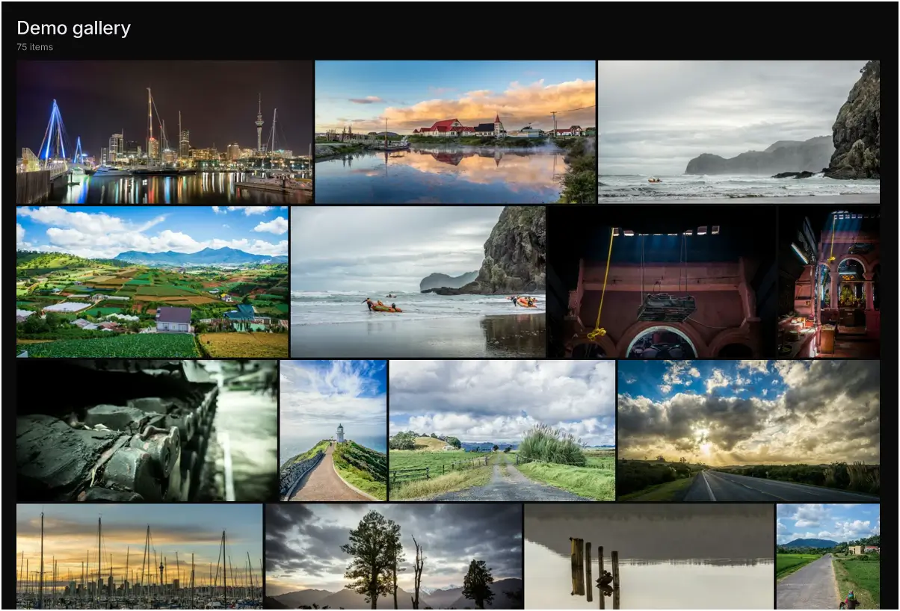

# Immich Public Proxy

<p align="center" width="100%">

</p>

<p align="center" width="100%">
<a href="https://hub.docker.com/r/alangrainger/immich-public-proxy/tags">
    </a>
<a href="https://github.com/alangrainger/immich-public-proxy/releases/latest">
    </a>
<a href="https://immich-demo.note.sx/share/gJfs8l4LcJJrBUpjhMnDoKXFt1Tm5vKXPbXl8BgwPtLtEBCOOObqbQdV5i0oun5hZjQ"></a>
</p>

Share your Immich photos and albums in a safe way without exposing your Immich instance to the public.

👉 See a [Live demo gallery](https://immich-demo.note.sx/share/gJfs8l4LcJJrBUpjhMnDoKXFt1Tm5vKXPbXl8BgwPtLtEBCOOObqbQdV5i0oun5hZjQ)
serving straight out of my own Immich instance.

Setup takes less than a minute, and you never need to touch it again as all of your sharing stays managed within Immich.

<p align="center" width="100%">

</p>

### Table of Contents

- [About this project](#about-this-project)
- [Installation](#installation)
- [How to use it](#how-to-use-it)
- [How it works](#how-it-works)
- [Configuration](docs/configuration.md)
- [Troubleshooting](#troubleshooting)
- [Feature requests](#feature-requests)

## About this project

[Immich](https://github.com/immich-app/immich) is a wonderful bit of software, but since it holds all your private photos it's 
best to keep it fully locked down. This presents a problem when you want to share a photo or a gallery with someone.

**Immich Public Proxy** provides a barrier of security between the public and Immich, and _only_ allows through requests
which you have publicly shared.

It is stateless and does not know anything about your Immich instance. It does not require an API key which reduces the attack 
surface even further. The only things that the proxy can access are photos that you have made publicly available in Immich. 

### Features

- Supports sharing photos and videos.
- Supports password-protected shares.
- If sharing a single image, by default the link will directly open the image file so that you can embed it anywhere you would a normal image. (This is configurable.)
- Gallery styled to match Immich's native look, with light/dark mode following the visitor's system preference.
- Handles very large shares smoothly thanks to virtualized rendering - the browser only keeps tiles near the viewport in the DOM.
- Optional multi-select mode so visitors can pick specific photos and download them together as a zip.
- Optional date-grouped view (off by default), with month headers like "December 2024".
- All usage happens through Immich - you won't need to touch this app after the initial configuration.

### Why not simply put Immich behind a reverse proxy and only expose the `/share/` path to the public?

To view a shared album in Immich, you need access to the `/api/` path. If you're sharing a gallery with the public, you need
to make that path public. Any existing or future vulnerability has the potential to compromise your Immich instance.

For me, the ideal setup is to have Immich secured privately behind mTLS or VPN, and only allow public access to Immich Public Proxy.
Here is an example setup for [securing Immich behind mTLS](./docs/securing-immich-with-mtls.md) using a reverse proxy such as Caddy or Traefik.

## Installation

### Install with Docker / Podman

1. Download the [docker-compose.yml](https://github.com/alangrainger/immich-public-proxy/blob/main/docker-compose.yml) file.

2. Update the value for `IMMICH_URL` in your docker-compose file to point to your local URL for Immich. This should not be a public URL.

3. Update or remove the value for `PUBLIC_BASE_URL`. This should be the public base URL for IPP, without a trailing slash (example `https://your-proxy-url.com`). 
If you remove this value, it will dynamically generate it based on the request hostname. This can be useful if you are [serving from multiple domains](#serving-from-multiple-domains).

4. _Optional_: Add `IPP_PORT` to environment variables in your docker-compose file to change the port from the default of 3000. 
This is the _internal_ webserver port inside the container. Most people will not need to do this. Note that you will have to change the `ports` and `healthcheck` sections accordingly.

5. Start the docker container. You can test that it is working by visiting `https://your-proxy-url.com/share/healthcheck`. 
Check the container console output for any error messages.

```bash
docker-compose up -d
```

6. Set the "External domain" in your Immich **Server Settings** to be whatever domain you use to publicly serve Immich Public Proxy:


Now whenever you share an image or gallery through Immich, it will automatically create the correct public path for you.

🚨 **IMPORTANT**: If you're using Cloudflare, please make sure to set your `/share/video/*` path to Bypass Cache, otherwise you may
run into video playback issues. See [Troubleshooting](#troubleshooting) for more information.

#### Running alongside Immich on a single domain

Because all IPP paths are under `/share/...`, you can run Immich Public Proxy and Immich on the same domain.

See the instructions here: [Running on a single domain](./docs/running-on-single-domain.md).

### Install with Kubernetes

[See the docs here](docs/kubernetes.md).

## How to use it

Other than the initial configuration above, everything else is managed through Immich.

You share your photos/videos as normal through Immich. Because you have set the **External domain** in Immich settings
to be the URL for your proxy app, the links that Immich generates will automaticaly have the correct URL:


## How it works

When the proxy receives a request, it will come as a link like this:

```
https://your-proxy-url.com/share/ffSw63qnIYMtpmg0RNvOui0Dpio7BbxsObjvH8YZaobIjIAzl5n7zTX5d6EDHdOYEvo
```

The part after `/share/` is Immich's shared link public ID (called the `key` [in the docs](https://immich.app/docs/api/get-my-shared-link)).

**Immich Public Proxy** takes that key and makes an API call to your Immich instance over your local network, to ask what
photos or videos are shared in that share URL.

If it is a valid share URL, the proxy fetches just those assets via local API and returns them to the visitor as an
individual image or gallery.

If the shared link has expired or any of the assets have been put in the Immich trash, it will not return those.

All incoming data is validated and sanitised, and anything unexpected is simply dropped with a 404.

## Configuration

See **[the configuration docs](docs/configuration.md)** for the full reference.

## Troubleshooting

### Video playback

If you're using Cloudflare and having issues with videos not playing well, make sure your `/share/video/` paths are set to bypass cache.
I ran into this issue myself, and found [some helpful advice here](https://community.cloudflare.com/t/mp4-wont-load-in-safari-using-cloudflare/10587/48).

<a href="docs/cloudflare-video-cache.webp"></a>

I use Linux/Android, so this project is tested with BrowserStack for Apple/Windows devices.

### Can't reach Immich using `localhost:2283`

This is a normal Docker thing, nothing to do with IPP.

From inside a Docker container, you can't reach another container using `localhost`. You need to use a Docker network IP or your server's IP address.

[Here's a guide on connecting Docker containers](https://dionarodrigues.dev/blog/docker-networking-how-to-connect-different-containers).

## Feature requests

You can [add feature requests here](https://github.com/alangrainger/immich-public-proxy/discussions/categories/feature-requests?discussions_q=is%3Aopen+category%3A%22Feature+Requests%22+sort%3Atop),
however my goal with this project is to keep it as lean as possible.

Due to the sensitivity of data contained within Immich, this project optimises for auditability: the code 
stays small enough that someone with coding experience can review it for security-relevant behavior.

The most basic rule for this project is that it has **read-only** access to Immich.

Things that will not be considered for this project are:

- Anything that modifies Immich or its files in any way. If it requires an API key or privileged accesss, it won't be considered as a new feature.
- Uploading photos (see above).
