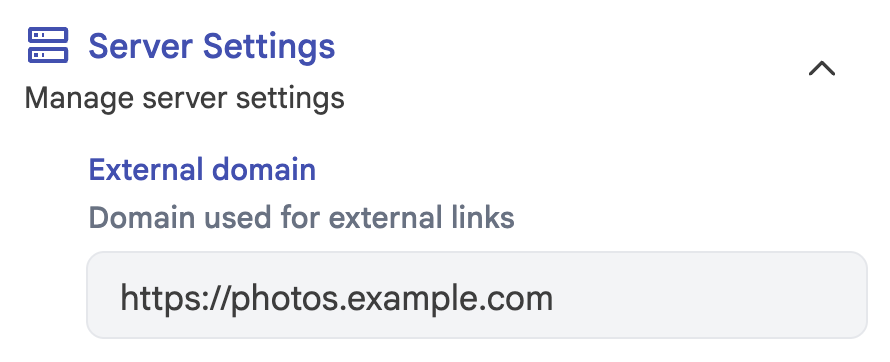

# Installation

> [!NOTE]
> IPP requires **Immich 3.0.0 or newer**. It checks the server version at startup and will exit with an error against an older Immich.

## Install with Docker / Podman

1. Download the [docker-compose.yml](https://github.com/alangrainger/immich-public-proxy/blob/main/docker-compose.yml)
   file.

2. Update the value for `IMMICH_URL` in your docker-compose file to point to your local URL for Immich. **This should
   not be a public URL.** Most likely this will be a local IP and port; whatever your Immich container runs on.

3. Update or remove the value for `PUBLIC_BASE_URL`. This should be the public base URL for IPP, without a trailing
   slash (example `https://photos.example.com`). If you remove this value, it will dynamically generate it based on
   the request hostname. This can be useful if you are [serving from multiple domains](/running-on-single-domain).

4. Start the docker container. Check the container console output for any error messages.

```bash
docker-compose up -d
```

5. Point your reverse proxy at the container on port 3000, so IPP is served over HTTPS at your `PUBLIC_BASE_URL`.
   See [Put IPP behind a reverse proxy](/reverse-proxy) for Caddy, nginx and Traefik examples. You can test that it
   is working by visiting `https://photos.example.com/share/healthcheck`.

6. Set the "External domain" in your Immich **Server Settings** to be whatever domain you use to publicly serve
   Immich Public Proxy:



Now whenever you share an image or gallery through Immich, it will automatically create the correct public path for
you.

> [!WARNING]
> If you're using Cloudflare, please make sure to set your `/share/video/*`, `/share/*/download` and `/s/*/download`
> paths to Bypass Cache, otherwise you may run into video playback issues and failed zip downloads. See
> [Troubleshooting](/troubleshooting) for more information.

Those two variables are all most people need. The port and the config file location are covered under
[Environment variables](/config/environment-variables), and everything about how galleries look and behave under
[Configuration](/config/).

### Docker images

Images are published to Docker Hub (`alangrainger/immich-public-proxy`) and GitHub Container Registry
(`ghcr.io/alangrainger/immich-public-proxy`) for `linux/amd64` and `linux/arm64`. Each release is tagged with its
full version (for example `4.0.0`), its minor version (`4.0`) and its major version (`4`), and `latest` always points
at the newest release.

The optional upload service, `alangrainger/immich-public-proxy-upload`, is published in the same places with the same
version tags. You only need it to [let visitors send photos back](/visitor-uploads).

### Running alongside Immich on a single domain

Because all IPP paths are under `/share/...` and `/s/...`, you can run Immich Public Proxy and Immich on the same
domain. See [Running on a single domain](/running-on-single-domain).

## Install with Kubernetes

See the [Kubernetes install docs](/kubernetes).

Next: [Sharing from Immich](/how-to-use).
