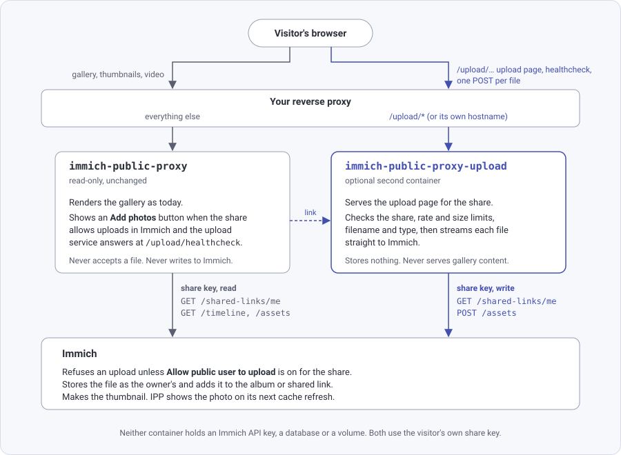

# Let visitors send photos back

Visitors to a share can send their own photos and videos into it, for example guests adding their pictures to a
wedding album. The photos go straight into the album in Immich and appear in the gallery for everyone, unless you
choose to [review them first](/tag-and-review-uploads#review-uploads-before-they-appear).

> [!IMPORTANT]
> No Immich API key is needed: each file is sent with the share's own key, so Immich itself decides whether that share accepts uploads.
> 
> Visitors have no access to Immich; the upload service streams each file through and stores nothing.

## Contents

- [How it works](#how-it-works)
- [What you need](#what-you-need)
- [Add the upload service](#add-the-upload-service)
- [Route it through your reverse proxy](#route-it-through-your-reverse-proxy)
- [Turn on uploads for a share](#turn-on-uploads-for-a-share)
- [Set a storage quota](#set-a-storage-quota)
- [Request size limits](#request-size-limits)
- [Get a notification for each upload](#get-a-notification-for-each-upload)
- [Turn uploads off](#turn-uploads-off)
- [Questions](#questions)

## How it works

Uploads are handled by a second, optional container, `immich-public-proxy-upload`. The IPP container stays
read-only.

**No API key is required.**



1. In Immich, the owner turns on **Allow public user to upload** for a shared link. The gallery for that share then
   shows an **Add photos** button.
2. A visitor clicks the button. It opens the upload page for the same share on the upload service's separate container.
3. The upload container streams the file straight to Immich with the share's own key. It stores nothing and holds no API key.
4. Immich checks that the share still allows uploads, stores the file as if the share owner had uploaded it, and adds
   it to the share.

What the owner sees in Immich:

- The files appear at once in the owner's timeline, at the date each photo was taken, as with any upload. They
  belong to the owner and count against the owner's storage.
- In an album share, the files go into the album. In a share of selected photos, they go into the shared link, so
  they show in the same gallery.
- Each file name starts with `ipp_upload_`, so visitor uploads are easy to find in search or to
  [tag with a workflow](/tag-and-review-uploads#tag-uploaded-photos). The prefix can be changed or
  [turned off](/config/upload-service#filenameprefix).
- The owner removes unwanted files in Immich, like any other photo.

Other visitors see the new photos in the gallery within a few minutes. See
[When do uploads appear](#when-do-uploads-appear). To approve photos before they appear, use a
[review workflow](/tag-and-review-uploads#review-uploads-before-they-appear).

## What you need

- IPP 4.0 or newer and Immich 3.0.0 or newer. Restarting the IPP container does not update it: run
  `docker compose pull` first (see [Updating IPP](/upgrading#updating-ipp)). A 3.x IPP serves the gallery as before
  and never shows the button, whatever the upload service does.
- A public route to the upload service, either:
  - a path on the IPP hostname, such as `photos.example.com/upload`, or
  - its own hostname, such as `upload.example.com`. Use this if a tunnel points straight at IPP with no reverse
    proxy: add a second hostname to the tunnel for the upload container.

## Add the upload service

Add the service to the `docker-compose.yml` that runs IPP:

```yaml
services:
  immich-public-proxy:
    # ... your existing IPP service ...

  ipp-upload:
    image: alangrainger/immich-public-proxy-upload:latest
    container_name: ipp-upload
    restart: always
    ports:
      - "3001:3000"
    read_only: true
    cap_drop:
      - ALL
    security_opt:
      - no-new-privileges
    environment:
      IMMICH_URL: http://your-internal-immich-server:2283
      PUBLIC_BASE_URL: https://photos.example.com
    healthcheck:
      test: curl -sf -m 4 http://localhost:3000/healthcheck -o /dev/null || exit 1
      start_period: 10s
      timeout: 5s
```

- `IMMICH_URL` and `PUBLIC_BASE_URL` mean the same as on the IPP container, so you can copy the `environment` block
  across. `PUBLIC_BASE_URL` is IPP's public URL; it gives the upload page a back button to the gallery.
- `read_only`, `cap_drop` and `security_opt` lock the container down. They are optional: the service writes
  nothing to disk and needs no extra privileges, so it runs the same with or without them.

The service has no setting for its own public URL. Your reverse proxy decides that in the next step.

Start it with `docker-compose up -d`. The full list of settings is on [Upload service](/config/upload-service).

## Route it through your reverse proxy

The upload service serves its pages both under `/upload` and at the root, so it fits either of these shapes with no
URL setting. In the examples, `ipp-address:port` is whatever address your reverse proxy already uses to reach IPP,
and `ipp-upload-address:port` is the same for the upload service: the same host, on the port you published for it,
`3001` with the compose file above.

### Path on the IPP hostname

One domain, no extra certificate. Forward `/upload/*` to the upload service with the path left in place, and
everything else to IPP.

#### Caddy

Use `handle`, which keeps the path; `handle_path` would strip it.

```
photos.example.com {
    handle /upload/* {
        reverse_proxy ipp-upload-address:port
    }
    handle {
        reverse_proxy ipp-address:port
    }
}
```

#### nginx

No trailing slash on the upload `proxy_pass`. With `proxy_pass http://ipp-upload-address:port/;`, nginx replaces the
`/upload/` prefix with that `/` and the service receives `/share/<key>` instead of `/upload/share/<key>`. It then
writes every link on its pages without `/upload`, so the browser sends them to IPP instead: the page's script is a
404 and the password form posts to the wrong service, which asks for the password again.

```nginx
server {
    listen 443 ssl;
    server_name photos.example.com;

    location /upload/ {
        client_max_body_size 500m;
        proxy_request_buffering off;
        proxy_pass http://ipp-upload-address:port;
    }

    location / {
        proxy_pass http://ipp-address:port;
    }
}
```

### Own hostname

Send everything on a separate upload hostname to the upload service.

#### Caddy

```
upload.example.com {
    reverse_proxy ipp-upload-address:port
}
```

#### nginx

```nginx
server {
    listen 443 ssl;
    server_name upload.example.com;

    client_max_body_size 500m;
    proxy_request_buffering off;

    location / {
        proxy_pass http://ipp-upload-address:port;
    }
}
```

#### Tell IPP the upload URL

Set [`uploadUrl`](/config/ipp-options#uploadurl) in IPP's config to the upload hostname and restart IPP:

```json
{
  "ipp": {
    "uploadUrl": "https://upload.example.com"
  }
}
```

IPP reads its config from a `config.json` mounted at `/app/config.json`, or inline from the `CONFIG` environment
variable; see [Configuration](/config/). One `config.json` can serve both containers: IPP ignores the `ipp.upload.*`
keys, and the upload service reads only those and [two shared options](/config/upload-service#shared-options).

### Check the route

Open `/healthcheck` on the upload URL: `https://photos.example.com/upload/healthcheck` or
`https://upload.example.com/healthcheck`. It answers `ok` when the upload service can reach Immich, and a 503 when
it cannot. With the upload service on a path on the IPP hostname, IPP shows the **Add photos** button only while
this answers `ok`. With its own hostname, IPP shows the button whenever `uploadUrl` is set.

An empty page at `https://photos.example.com/upload/healthcheck` means the request reached IPP, not the upload
service: IPP answers its own hostname's `/upload/healthcheck` with nothing when the route is missing. Check the
`/upload` route in the reverse proxy.

Then open `https://photos.example.com/upload/share/<key>` for a share that allows uploads. The upload page should
load with its styling, and a password-protected share should accept its password once. See
[The "Add photos" button does not appear](/troubleshooting#the-add-photos-button-does-not-appear) and
[The upload page asks for the password again](/troubleshooting#the-upload-page-asks-for-the-password-again-or-its-script-is-a-404)
if not.

## Turn on uploads for a share

In Immich, turn on **Allow public user to upload** for the shared link. The option is in the dialog that creates a
link, and later under **Sharing > Shared links**, when you edit the link. The gallery for that share then shows an
**Add photos** button in its header. A share with the option off shows no button, and the upload service refuses it.

A password-protected share asks for its password again on the upload page. The upload service keeps its own unlock,
separate from IPP's, and the password never passes between the two.

> [!NOTE]
> A share with one photo opens as the image file itself, so there is no header and no button. Set
> [`gallery.singleImage`](/config/gallery#singleimage) to `true` to show a gallery page instead, or give visitors the
> upload page's own link: the share's path on the upload URL, such as `https://photos.example.com/upload/share/<key>`.

## (Optional) Set a storage quota

By default an Immich user has unlimited storage. Set a quota on the user who owns the shares that accept uploads, so
visitors cannot fill the disk: in Immich go to **Administration**, **User Management**, edit the user and set
**Quota Size (GiB)**. Immich refuses uploads past the quota, whatever IPP's own limits allow.

The upload service also caps each share at 10 GB per hour by default. See
[`upload.byteBudget`](/config/upload-service#bytebudget).

## Request size limits

The upload service accepts files up to 500 MB by default ([`upload.maxFileSize`](/config/upload-service#maxfilesize)),
but anything in front of it can impose a lower limit. A file over that limit fails with "Too large for this server".

- **Caddy** and **Traefik** set no request size limit by default.
- **nginx** allows 1 MB by default. Set `client_max_body_size` to at least `maxFileSize`, and
  `proxy_request_buffering off` so nginx streams each file through instead of storing it first. Both are in the
  examples above.
- **Cloudflare** refuses requests over 100 MB on the Free and Pro plans, Cloudflare Tunnel included, so larger videos
  cannot pass through it. Set `maxFileSize` to `100` so the page tells visitors before the upload starts:

```json
{
  "ipp": {
    "upload": {
      "maxFileSize": 100
    }
  }
}
```

## Get a notification for each upload

Set [`upload.notifyUrl`](/config/upload-service#notifyurl) to a URL that receives a JSON message for each stored
file. Gotify needs nothing more; ntfy needs the template parameters shown on the reference page.

To tag uploads or hold them back until you approve them, see [Tag and review visitor uploads](/tag-and-review-uploads).

## Turn uploads off

For one share, turn off **Allow public user to upload** in Immich. Immich refuses new uploads at once, and the button
leaves the gallery on the same cache times as a new photo takes to appear (see
[When do uploads appear](#when-do-uploads-appear)). For all shares, stop the upload container; with the default
`uploadUrl` the button goes with it. To make sure, set [`uploadUrl`](/config/ipp-options#uploadurl) to `""`.

## Questions

### When do uploads appear

The owner sees them in Immich at once. Other visitors see them in the gallery once three things have happened:

1. Immich has made the thumbnail. That takes seconds for a photo and longer for a video, and IPP hides a photo until
   then.
2. IPP's cache of the share has expired. It is kept for up to 2 minutes.
3. The visitor's browser has fetched the gallery page again. It keeps the page for
   [`gallery.cacheTime`](/config/gallery#cachetime), 5 minutes by default.

So a new photo can take up to about 7 minutes to show for a visitor who already had the gallery open.

### What happens when a visitor sends a photo the owner already has

Immich keeps the one copy and adds it to the share. The visitor's list shows the file as a duplicate.

### What if a visitor sends a malicious file

The upload container never opens the file. It only accepts image and video types, and streams the bytes to Immich.
Immich also rejects anything outside its own list, then processes it like any other upload. To check uploads before
they reach the gallery, use a [review workflow](/tag-and-review-uploads#review-uploads-before-they-appear).

### Can visitors see who uploaded what, or remove photos

No. The upload page shows nothing from the share, only the visitor's own uploads in progress, and nothing can be
deleted or edited from it. The owner manages uploads in Immich.

### Why is uploading a separate container

Three reasons, in order of importance:

- **IPP stays read-only.** The gallery container has no code that accepts a file or writes to Immich. If you do not
  run the upload service, nothing in IPP can write to your library, and that holds no matter what a visitor sends.
- **A problem with uploads cannot take down the gallery.** A visitor who floods the upload service with files or
  connections can exhaust that container, and the gallery keeps serving from its own.
- **You can treat the two differently.** Viewing and uploading can run on separate domains or separate servers,
  with different rate limits, geoblocks or access rules in your reverse proxy. A single container would still let
  you split by path, but not to the same degree.

### Why does the rate limit count all visitors together

Behind a reverse proxy every visitor reaches the upload service from the proxy's address, so
[`upload.rateLimit`](/config/upload-service#ratelimit) applies to all visitors of a share together. To limit each
visitor separately, set a rate limit in your reverse proxy.
